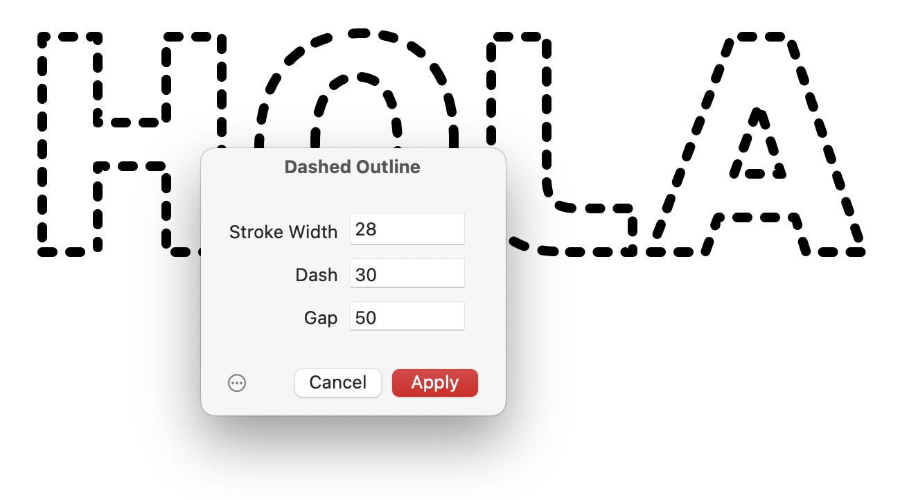

# Dashed Outline

*Filter > Dashed Outline* (de: *Gestrichelte Kontur*) is a Glyphs.app filter for creating a dashed outline around your glyphs:

## Installation

Dashed Outline is [available in the Glyphs&nbsp;3 Plugin Manager](glyphsapp3://showplugin/Dashed%20Outline). Click on the *Install* button next to it and restart Glyphs. The plug-in will appear in your *Filter* menu.

It was written for Glyphs&nbsp;3.1. It may work in earlier versions of the software but it is not tested and I cannot guarantee it.

# License

Copyright 2022 Rainer Erich Scheichelbauer (@mekkablue). Builds on template code by Georg Seifert (@schriftgestalt) and Jan Gerner (@yanone).

Licensed under the Apache License, Version 2.0 (the "License");
you may not use this file except in compliance with the License.
You may obtain a copy of the License at

http://www.apache.org/licenses/LICENSE-2.0

See the License file included in this repository for further details.
